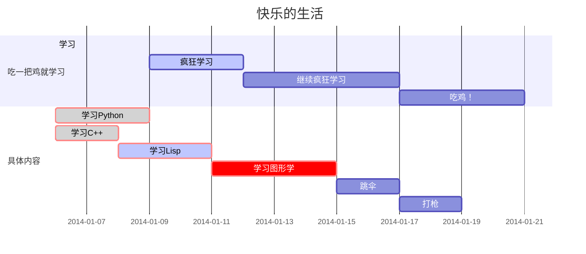
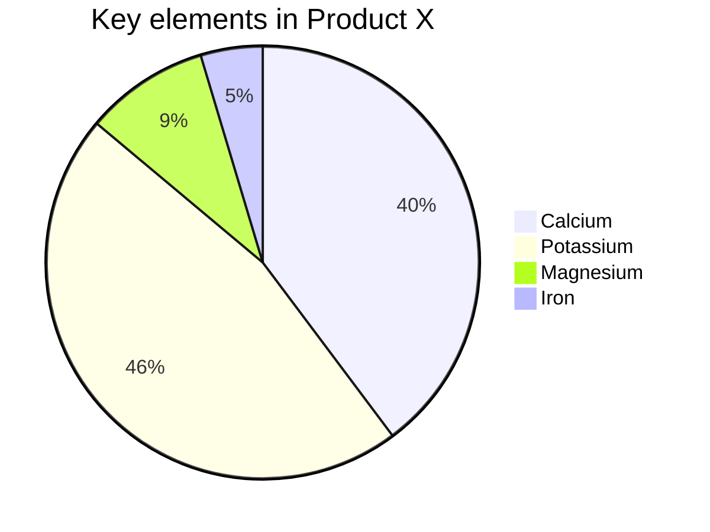
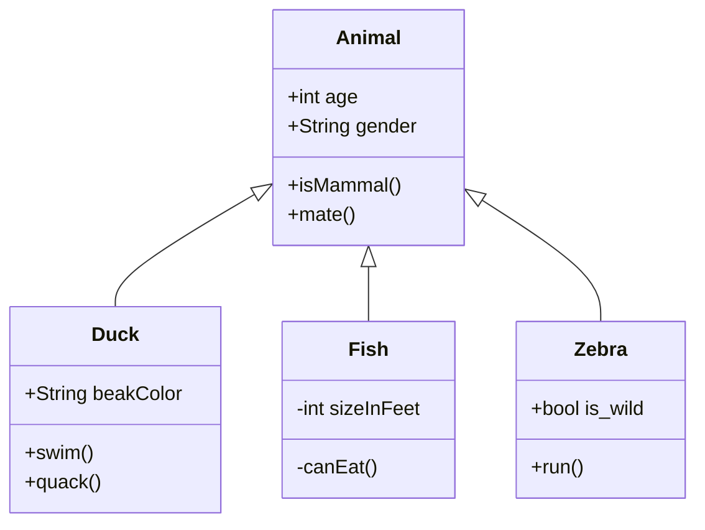

```flow
除了Sequence和Flowchart两类图之外，Mermaid还提供一种叫做gantt的图
st=>start: 闹钟响起
op=>operation: 与床板分离
cond=>condition: 分离成功?
e=>end: 快乐的一天

st->op->cond
cond(yes)->e
cond(no)->op
```

```sequence
李雷 -> 韩梅梅 : hello , how are you?
Note right of 韩梅梅 :She is thinking
韩梅梅 --> 李雷 : I'm fine ,thanks, and you ?
```

```gas
```





饼图使用 `pie` 表示，标题下面分别是区域名称及其百分比。



语法解释：`<|--` 表示继承，`+` 表示 `public`，`-` 表示 `private`，学过 Java 的应该都知道
